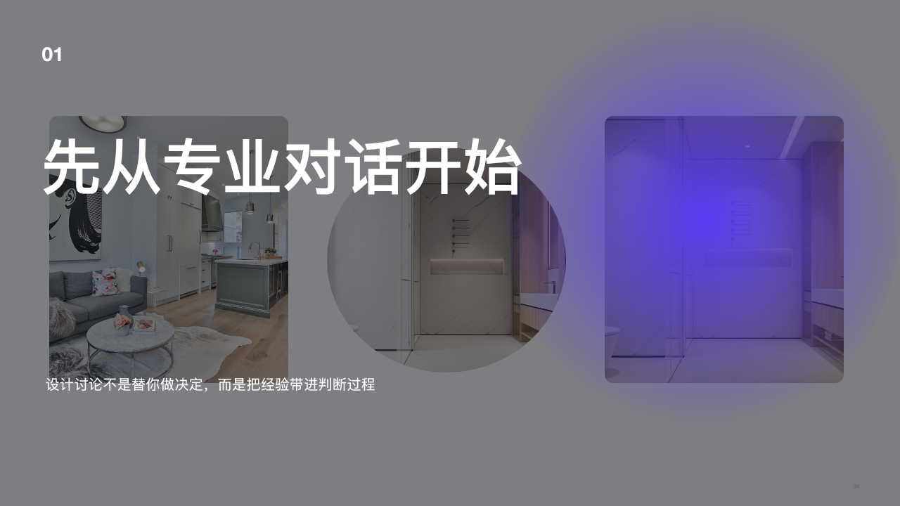
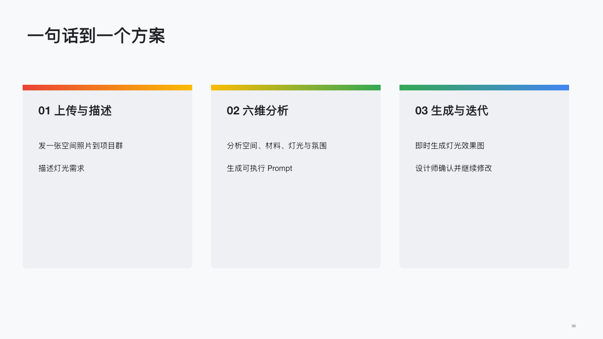
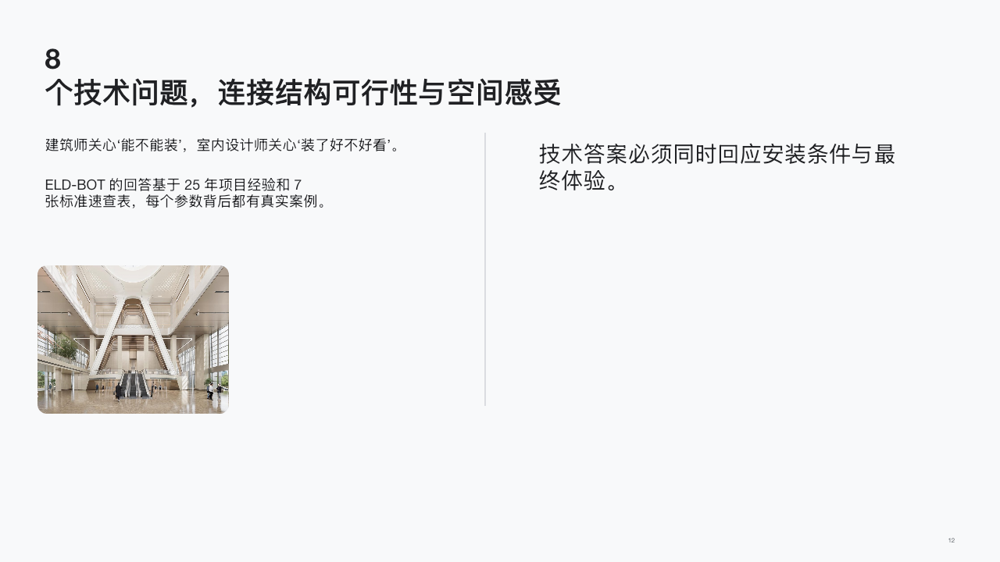
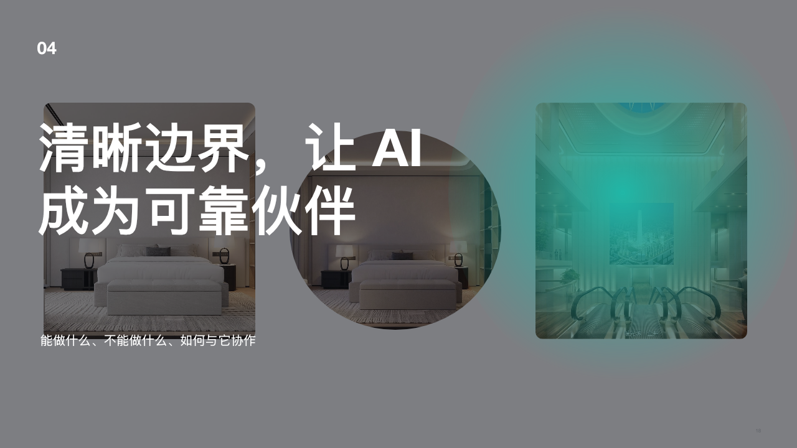

# Google-Inspired Editorial PPT

把普通 PowerPoint 重建设计为克制、清晰、具有杂志感的企业级演示文稿，同时保留可编辑文本、图表、形状与页面结构。


> 上图为风格能力示意。下方案例图来自该 Skill 的真实 PPTX 渲染结果。

## 能做什么

| 能力 | 说明 |
| --- | --- |
| 视觉换新 | 更换图片、配色、字体层级、留白、裁切与视觉氛围 |
| 完整重建 | 把原 PPT 当作内容素材库，重新组织叙事、拆页、并页与编排 |
| 新建演示 | 根据 brief 或大纲生成新的 16:9 商务演示文稿 |
| 保持可编辑 | 文本、表格、图表、形状和页面家具尽量保留为原生对象 |
| 内容可追溯 | 保存输入页与输出页之间的映射，不静默丢失业务事实 |
| 渲染质检 | 对布局、字体、图片、节奏、样式和画布溢出进行检查 |

## 设计效果示例

以下图片展示同一套设计系统能够覆盖的不同页面任务。

### 图片主导的封面


### 杂志式章节页



### 流程与信息卡片



### 长文本与观点页



### 深色电影感章节



## 三种工作模式

### `visual_only`

适用于“结构和内容不要改，只优化图片和风格”。

- 保持页数与页序
- 保持可见文案、数字与数据
- 只调整图片、配色、字体、间距、裁切和视觉氛围
- 隐藏或替换制作备注、空图片提示和内部编辑指令

### `full_rebuild`

适用于“不要沿用原 PPT 页序，把它当作业务素材库重新讲故事”。

- 允许重新排序、拆页和并页
- 保留事实、数字、日期、单位、限定条件和来源
- 每页只保留一个主要结论与一个视觉焦点
- 保存源页到输出页的内容映射

### `new_deck`

适用于没有原始 PPT、只有 brief、文档或大纲的情况。

- 根据输入信息建立叙事结构
- 不凭空编造业务事实
- 使用统一的企业编辑视觉系统生成整套演示

## 风格分支

- `spectral_enterprise`：冷灰画布、近黑文字、克制的光谱渐变，适合科技、AI、研究与咨询主题。
- `warm_editorial`：暖白画布、炭黑文字、琥珀或铜色点缀，适合品牌、建筑、材料与高端商业内容。
- `dark_cinematic`：近黑背景、稀疏亮色文字与大幅摄影，适合封面、章节、宣言和结尾页。

## 安装

直接克隆到 Codex Skills 目录：

```bash
git clone https://github.com/CYFanna0710-netizen/google-inspired-editorial-ppt.git \
  ~/.codex/skills/google-inspired-editorial-ppt
```

重新打开 Codex 后即可在任务中调用。

## 使用示例

只改变图片和风格：

```text
请使用 google-inspired-editorial-ppt skill 处理这个 PPT。
选择 visual_only 模式，不改变结构、页序、文案和数据。
把图片与整体风格改成高级、克制的杂志编辑风。
```

完整重建叙事：

```text
请使用 google-inspired-editorial-ppt skill。
选择 full_rebuild 模式，把原 PPT 当作业务素材库，
重新组织叙事和页面结构，保留全部事实、数字与来源。
```

从 brief 新建：

```text
请使用 google-inspired-editorial-ppt skill。
根据这份 brief 创建一套 16:9 企业级演示文稿，
使用 spectral_enterprise 风格并完成渲染质检。
```

## 工作流程

1. 解析 PPTX 页面、文字、图片、图表与关系文件。
2. 提取原始项目素材，区分受众内容与制作备注。
3. 根据用户要求选择唯一工作模式和风格分支。
4. 建立逐页视觉计划与内容映射。
5. 使用原生可编辑对象重建演示文稿。
6. 渲染全部页面，检查整套节奏与单页细节。
7. 运行内容、布局、字体、图片、样式与文件结构验证。

## 目录

```text
google-inspired-editorial-ppt/
├── SKILL.md
├── README.md
├── agents/
├── assets/
│   ├── fonts/
│   ├── graphics/
│   ├── icons/
│   └── templates/
├── docs/
│   └── images/
├── references/
├── schemas/
└── scripts/
```

## 设计原则

- 不复制 Google 标志、品牌页脚或专有视觉资产。
- 不使用没有授权的字体和图片。
- 不用整页截图掩盖排版问题。
- 不把可编辑文案烘焙进生成图片。
- 自动检查只作为证据，最终结果仍需经过逐页视觉检查。

