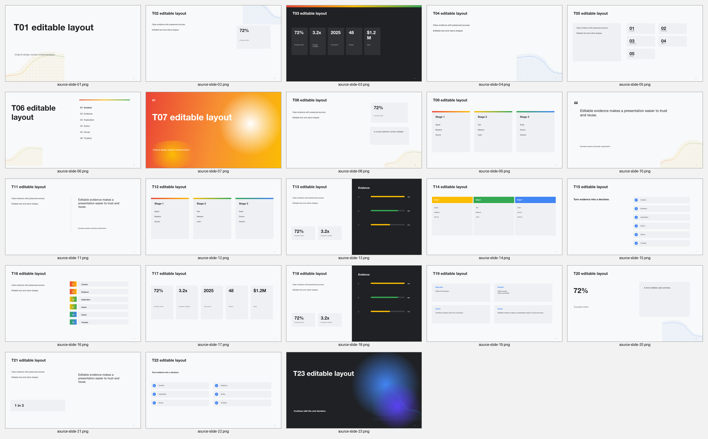
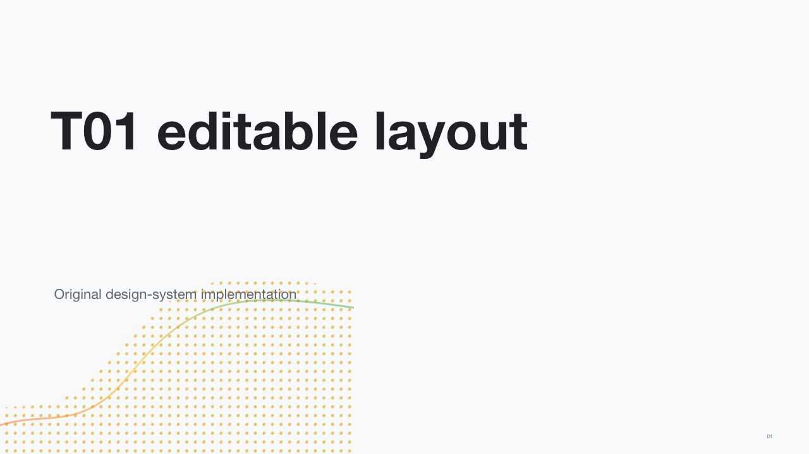
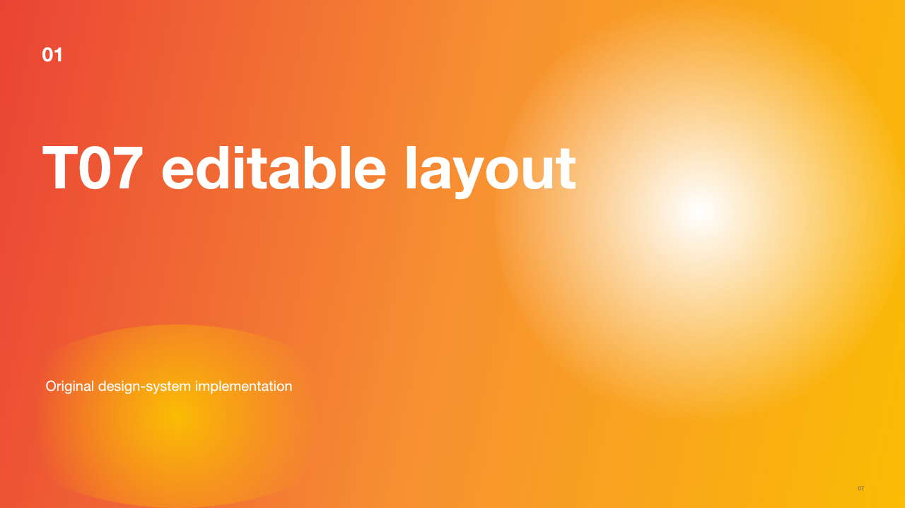
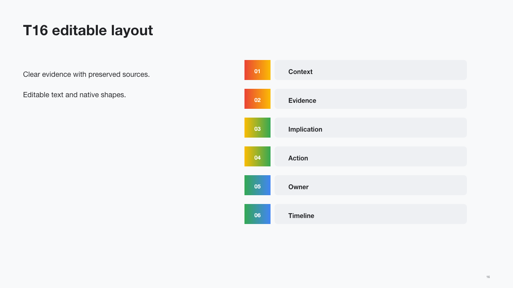
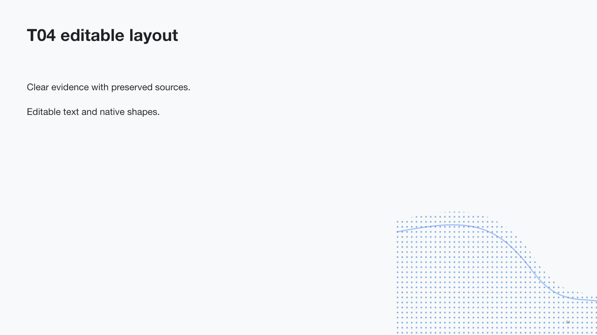
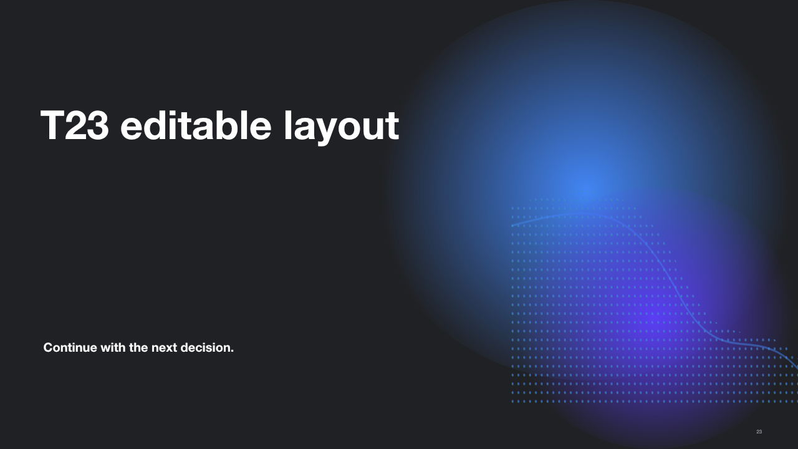

# Prismatic Mesh Editorial PPT

一个面向 Codex 的可运行 PPT 重组与重设计 Skill。它从 Google Cloud 企业演示中蒸馏视觉语言、排版决策和信息节奏，但不复制 Google Logo、品牌页脚、专有视觉资产或无授权字体。



> 展示图全部来自仓库内的23页可编辑母版，不使用任何客户项目成品作为风格示例。

## 当前能力

- 保留原始事实、数字、引用、来源和核心逻辑。
- 尽可能使用可编辑文字、形状、图表和布局对象，不把整页做成图片。
- 通过 Narrative Intelligence 与 Evidence Topology 重组叙事和证据。
- 先生成 Art Direction 与 Visual Concept，再进行 Composition Solver 和模板能力匹配。
- 将 T01–T23 视为 Render Primitive，不从模板反推设计概念。
- 使用 insight headline、弥散渐变、二维视觉重量、留白和尺度反差建立 Google Cloud 式信息表达。
- 对 Motif、Mesh、渐变和 Organic Asset 执行语义检查；无明确职责时允许完全不使用。
- 运行结构、内容、字体、编辑性、Visual DNA、审美与相邻页面节奏检查。

## Planner 架构

### Planner 5.0

默认稳定路径：

```text
SOURCE CONTENT
→ Narrative Intelligence
→ Evidence Topology
→ Art Direction Engine
→ Visual DNA
→ Motif Engine
→ Composition Solver
→ Template Capability Matching
→ Organic Asset Selection
→ Renderer
→ QA
```

### Planner 6.0 Visual Concept Intelligence MVP

Planner 6.0 在模板匹配之前增加视觉语法候选生成和评分：

```text
communication goal
→ semantic relationship
→ visual action
→ 3 visual concept candidates
→ scoring and selection
→ required capabilities
→ template capability matching
```

如果当前23页骨架无法真实表达所需关系，系统返回 `renderer_capability_gap`，不会用最接近的三栏、卡片或流程页替代。

## 23页 Template Capability Manifest

仓库包含可编辑23页页面骨架及逐页能力清单：

- `assets/templates/base-template-23p-capability-source.pptx`
- `references/template-capability-manifest.json`
- `references/visual-grammar-template-map.json`
- `schemas/template-capability-manifest.schema.json`
- `scripts/validate-template-capability-manifest.mjs`
- `scripts/run-template-capability-manifest-tests.mjs`

Manifest 会记录每页支持的语义关系、视觉动作、Hero Object、尺度能力、空间能力、数据能力、颜色能量、使用限制和失败风险。

## 23页母版视觉预览

### T01 超尺度标题与边缘 Mesh



### T07 连续弥散渐变章节页



### T16 结构化信息序列



### T04 留白主导叙事页



### T23 深色弥散收束页



## 安装

克隆到 Codex Skills 目录：

```bash
git clone https://github.com/CYFanna0710-netizen/google-inspired-editorial-ppt.git \
  ~/.codex/skills/prismatic-mesh-editorial-ppt
```

重新打开 Codex 后，可以通过 `$prismatic-mesh-editorial-ppt` 调用。

## 调用示例

```text
使用 $prismatic-mesh-editorial-ppt Planner 5.0 重组并重设计这份 PPT。
保留全部事实、数据、来源和可编辑对象，完成渲染与自动质检后交付最终 PPTX。
```

进行 Planner 6.0 Visual Concept 审查：

```text
使用 $prismatic-mesh-editorial-ppt Planner 6.0 对指定页面生成3个视觉概念候选，
完成语义编码和能力匹配；如果母版能力不足，返回 renderer_capability_gap，暂不修改 Renderer。
```

## 验证

```bash
node scripts/validate-template-capability-manifest.mjs
node scripts/run-template-capability-manifest-tests.mjs --out /tmp/prismatic-template-tests
```

完整 PPT 生成仍需按照 `SKILL.md` 安装并使用 Presentations 运行环境与 `@oai/artifact-tool`。

## 设计边界

- 不复制 Google Logo、品牌页脚或专有视觉资产。
- 不使用无授权字体和图片。
- 不用整页截图掩盖排版问题。
- 不把可编辑文案烘焙进生成图片。
- 不把统计样本中的视觉比例硬编码为所有页面的统一阈值。
- Motif、Mesh 和渐变均为可选，纯装饰性加入会被拒绝。
- 自动评分不能代替最终人工视觉审查。

## Repository note

仓库沿用早期名称 `google-inspired-editorial-ppt`，当前 Skill 的正式调用名称为 `prismatic-mesh-editorial-ppt`。
